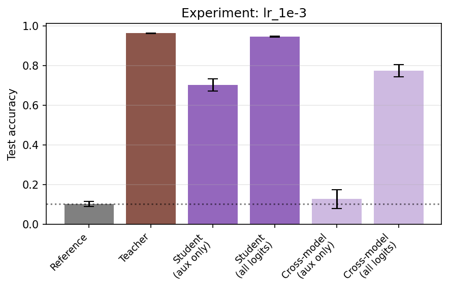
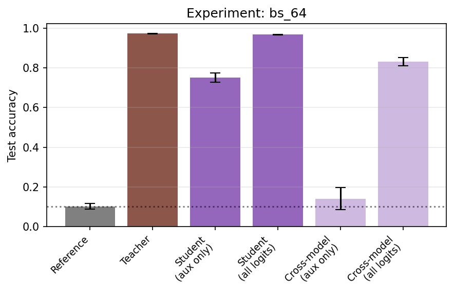
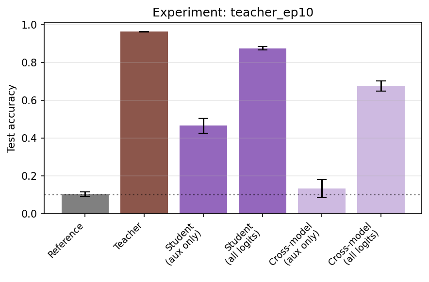
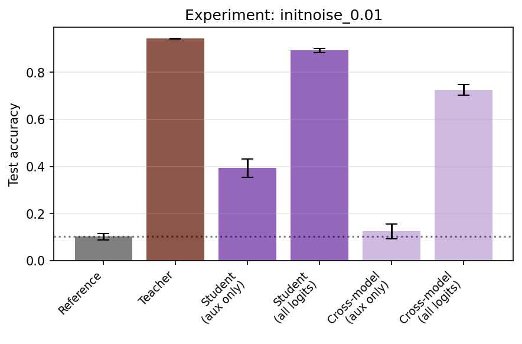
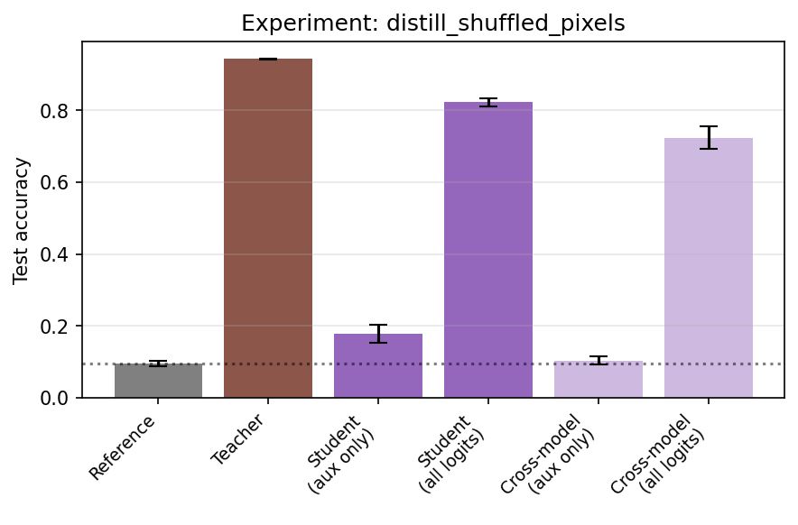

# Anthropic Fellows Takehome Project

Welcome to the takehome project! The topic of this project is ["subliminal learning"](https://alignment.anthropic.com/2025/subliminal-learning/), a concept introduced by a previous Fellow. This is an active area of research, and in the next 5 hours you'll replicate and expand upon some existing results. 

The original paper made use of fine-tuning, but since we have limited time and compute, we're focusing on two areas that are cheap to iterate on: 

    - Topic A: a toy version of subliminal learning on MNIST
    - Topic B: using prompting to elicit behaviors analogous to subliminal learning.

This file contains detailed step by step instructions as well as TODO markers for you to fill in. Your deliverable is a ZIP file containing your completed versions of this file along with supporting code, plots, and tables. Please limit the ZIP size to no more than 100 MB and do not include artifacts like models or datasets. 

Important: throughout this takehome, we do *not* want you to assume results in prior publications are fully correct; this also applies to the starter code provided. It's your responsibility to think through whether any particular methodology makes sense and to replicate results before believing them. 

> Divyat: I saw that there was a mistake in topic_a.py in the kl divergence implementation. 
> loss = nn.functional.kl_div(
    nn.functional.log_softmax(out, -1),
    nn.functional.softmax(tgt, -1),
    reduction="batchmean",
)
>out has shape (N_MODELS, batch_size, num_logits). PyTorch's "batchmean" divides the total sum by input.size(0) = N_MODELS (25), not by >N_MODELS * batch_size. So the loss is 1024x larger than a proper per-example mean.
>Compare to ce_first10 which .flatten(0, 1) then uses reduction="mean" — that correctly averages over all N_MODELS * batch_size examples.
>Hence, I changed the code to include flattening operation: .flatten(0, 1).

## Topic A - Subliminal Learning in a Toy Setting

To start with, run `topic_a.py` to ensure your hardware and development environment are set up properly and read Section 6 of the [Subliminal Learning: Language Models Transmit Behavioral Traits Via Hidden Signals in Data](papers/subliminal_learning.pdf) corresponding to the code. You don't need to follow all the math of Theorem 1. 

Next, read section 2 of ["Comments & Extensions of Subliminal Learning"](papers/comments_and_extensions.pdf). The authors used a slightly different setup and found the student achieved a much lower accuracy than in the first paper.

Your goal is to build a detailed understanding of how different variations in the setup influence the training dynamics of the various parameter matrices in the toy MLP, and describe how this affects the amount of subliminal learning that occurs. 

### Step 1

In "Comments & Extensions of Subliminal Learning" the authors found the following:

1. Increasing neurons per layer -> decreases
2. Increasing number of auxiliary logits -> increases
3. More or fewer layers -> approx the same
4. Change to FashionMNIST dataset -> still works

Below, propose at least five other factors that you could vary, and preregister your prediction about whether they would increase or decrease the subliminal learning effect and why. (Don't spend more than 5 minutes on this. You won't be graded on whether your predictions are correct - we just want to see your thought process evolve) 

1. Increasing learning rate → non-monotonic effect on subliminal accuracy (too large disrupts gradient alignment and destroys cross-head alignment).
2. Increasing batch size → decreases subliminal accuracy (larger batches reduce gradient noise, allowing auxiliary features to specialize and reducing cross-head alignment).
3. Increasing teacher training epochs → decreases subliminal accuracy (as the teacher becomes more specialized, auxiliary logits become more disentangled from digit structure, reducing cross-head alignment).
4. Increasing weight decay → decreases subliminal accuracy (stronger regularization shrinks shared weights, weakening auxiliary-induced feature shaping and reducing cross-head alignment).
5. Increasing the distance between teacher and student initialization → decreases subliminal accuracy (greater parameter misalignment reduces cross-head alignment).
6.  Distillation data distribution matters → inputs that broadly activate the teacher’s hidden representation (uniform/gaussian) preserve subliminal transfer, while structured but subspace-limited inputs (shuffled pixels) drastically reduce it.

### Step 2

Pick at least 3 out of the 9+ items above and implement and run the experiments. Report what happens using plots and/or tables. Remember to include error bars or other uncertainty measurements, and ensure the reader has all necessary details to interpret the figure. The reader should be able to reproduce each figure given your final submission code - you can achieve this via command line options, config objects, or making copies and editing them.

> Divyat: sweep_topic_a.sh can be used to reproduce all the various experiments.

#### Experiment 1: Learning Rate (Prediction 5)

**Hypothesis:** Non-monotonic effect — too small under-shapes shared representation, too large disrupts subtle gradient alignment.

**Setup:** Sweep lr in {1e-4, 3e-4, 1e-3, 3e-3, 1e-2}, holding all else at baseline (hidden_dim=256, n_hidden_layers=2, epochs_teacher=5, epochs_distill=5, m_ghost=3, distill_data=uniform, N=25 models).

| Learning Rate | Student Aux Acc | 95% CI | Cross-Model Aux Acc | Teacher Acc |
|:---:|:---:|:---:|:---:|:---:|
| 1e-4 | 0.318 | ± 0.028 | 0.109 ± 0.020 | 0.918 |
| 3e-4 (baseline) | 0.551 | ± 0.037 | 0.122 ± 0.039 | 0.943 |
| **1e-3** | **0.702** | **± 0.030** | 0.127 ± 0.047 | 0.964 |
| 3e-3 | 0.293 | ± 0.026 | 0.111 ± 0.018 | 0.966 |
| 1e-2 | 0.099 | ± 0.009 | 0.101 ± 0.011 | 0.948 |

**Result:** Confirmed non-monotonic. Peak subliminal accuracy occurs at lr=1e-3 (70.2%), well above chance (~10%). At lr=1e-2, the student's auxiliary accuracy collapses to chance, and at lr=1e-4 it only reaches 31.8%. Cross-model controls remain at chance for all LRs, confirming shared initialization is necessary. The effect is best explained by two competing forces: higher LR moves the shared hidden layers further from initialization (allowing auxiliary-driven features to also improve digit representations), but too high an LR overshoots and destroys the delicate cross-head alignment built during teacher training.

**Reproduce:** `python run_topic_a.py --exp_name lr_1e-3 --lr 1e-3` (and similarly for other LR values)

#### Experiment 2: Batch Size (Prediction 6)

**Hypothesis:** Larger batches reduce gradient noise, allowing auxiliary features to specialize and reducing accidental cross-task entanglement.

**Setup:** Sweep batch_size in {64, 256, 1024, 4096, 16384}, all else at baseline (lr=3e-4, epochs_teacher=5, epochs_distill=5, distill_data=uniform, N=25 models).

| Batch Size | Student Aux Acc | 95% CI | Cross-Model Aux Acc | Teacher Acc |
|:---:|:---:|:---:|:---:|:---:|
| **64** | **0.751** | **± 0.024** | 0.141 ± 0.055 | 0.973 |
| 256 | 0.683 | ± 0.038 | 0.133 ± 0.052 | 0.966 |
| 1024 (baseline) | 0.551 | ± 0.037 | 0.122 ± 0.039 | 0.943 |
| 4096 | 0.352 | ± 0.028 | 0.107 ± 0.017 | 0.907 |
| 16384 | 0.177 | ± 0.021 | 0.107 ± 0.015 | 0.807 |

**Result:** Confirmed monotonic decrease. Subliminal accuracy drops from 75.1% (bs=64) to 17.7% (bs=16384). Two effects contribute: (1) smaller batches produce noisier gradients that keep the hidden layers more entangled across heads, increasing subliminal transfer; (2) with fixed lr and epochs, smaller batches mean more gradient steps total, so both the teacher and student train further — note teacher accuracy also rises from 80.7% to 97.3% as batch size shrinks. The batch size effect is thus partly confounded with total training steps, but even comparing bs=64 (teacher 97.3%) to bs=256 (teacher 96.6%), where both teachers are well-trained, the subliminal gap persists (75.1% vs 68.3%), suggesting gradient noise helps subliminal transfer beyond the step-count effect.

**Reproduce:** `python run_topic_a.py --exp_name bs_64 --batch_size 64`

#### Experiment 3: Teacher Training Epochs (Prediction 7)

**Hypothesis:** More teacher training epochs → decreased subliminal accuracy, as the teacher's auxiliary logits become more disentangled from digit structure.

**Setup:** Sweep epochs_teacher in {1, 2, 5, 10, 20}, all else at baseline (lr=3e-4, distill_data=uniform, epochs_distill=5).

| Teacher Epochs | Student Aux Acc | 95% CI | Cross-Model Aux Acc | Teacher Acc |
|:---:|:---:|:---:|:---:|:---:|
| 1 | 0.602 | ± 0.032 | 0.123 ± 0.040 | 0.889 |
| **2** | **0.603** | **± 0.034** | 0.104 ± 0.015 | 0.915 |
| 5 (baseline) | 0.551 | ± 0.037 | 0.122 ± 0.039 | 0.943 |
| 10 | 0.466 | ± 0.040 | 0.134 ± 0.049 | 0.963 |
| 20 | 0.371 | ± 0.033 | 0.108 ± 0.018 | 0.974 |

**Result:** Confirmed monotonic decrease. As the teacher trains longer (1→20 epochs), its digit accuracy increases (88.9%→97.4%), but the student's subliminal auxiliary accuracy drops (60.3%→37.1%). This supports the hypothesis that longer teacher training causes the weight matrices to specialize: the teacher's hidden representations become more task-specific for digit classification, which means the auxiliary head draws less on shared digit-useful features. Early in training, the teacher's hidden layers are still close to the random initialization and the auxiliary head cannot help but use features that are also digit-relevant; as training progresses, the auxiliary head learns to rely on features orthogonal to digit classification.

**Reproduce:** `python run_topic_a.py --exp_name teacher_ep10 --epochs_teacher 10`

#### Experiment 4: Weight Decay (Prediction 8)

**Hypothesis:** Stronger weight decay (L2 regularization) decreases subliminal accuracy by shrinking shared weights and weakening auxiliary-induced feature shaping.

**Setup:** Sweep weight_decay in {0.0, 1e-4, 1e-3, 1e-2, 0.1}, applied to both teacher training and distillation optimizers. All else at baseline (lr=3e-4, epochs_teacher=5, epochs_distill=5).

| Weight Decay | Student Aux Acc | 95% CI | Cross-Model Aux Acc | Teacher Acc |
|:---:|:---:|:---:|:---:|:---:|
| **0.0 (baseline)** | **0.551** | **± 0.037** | 0.122 ± 0.039 | 0.943 |
| 1e-4 | 0.120 | ± 0.012 | 0.102 ± 0.012 | 0.941 |
| 1e-3 | 0.091 | ± 0.009 | 0.091 ± 0.010 | 0.915 |
| 1e-2 | 0.091 | ± 0.010 | 0.090 ± 0.010 | 0.805 |
| 0.1 | 0.091 | ± 0.010 | 0.091 ± 0.010 | 0.275 |

**Result:** Confirmed — weight decay is the most potent killer of subliminal learning among all factors tested. Even the smallest nonzero value (wd=1e-4) collapses subliminal accuracy from 55.1% to 12.0%, despite the teacher maintaining 94.1% digit accuracy. At wd≥1e-3, the student is indistinguishable from cross-model controls (~9% ≈ chance). This is striking because wd=1e-4 barely affects the teacher's task performance but completely destroys subliminal transfer. The mechanism is clear: L2 regularization drives all weights toward zero, which shrinks the shared hidden representations that carry the cross-head alignment signal. Since subliminal learning depends on precise weight-level correspondence between teacher and student (as shown in Experiment 5), even slight shrinkage during training breaks this correspondence.

**Reproduce:** `python run_topic_a.py --exp_name wd_1e-4 --weight_decay 1e-4`

#### Experiment 5: Init Distance (Prediction 9)

**Hypothesis:** Increasing the distance between teacher and student initialization decreases subliminal accuracy, as parameter misalignment weakens cross-head alignment.

**Setup:** After copying the shared initialization to the student, add i.i.d. Gaussian noise with std in {0.0, 0.01, 0.05, 0.1, 0.5, 1.0} to all student parameters. All else at baseline (lr=3e-4, epochs_teacher=5, epochs_distill=5). Note: the default weight init std is ~1/sqrt(784) ≈ 0.036 for the first layer, so noise=0.05 is already comparable to the original init scale.

| Init Noise (std) | Student Aux Acc | 95% CI | Cross-Model Aux Acc | Teacher Acc |
|:---:|:---:|:---:|:---:|:---:|
| **0.0 (baseline)** | **0.551** | **± 0.037** | 0.122 ± 0.039 | 0.943 |
| 0.01 | 0.393 | ± 0.038 | 0.125 ± 0.031 | 0.943 |
| 0.05 | 0.105 | ± 0.008 | 0.100 ± 0.008 | 0.943 |
| 0.1 | 0.107 | ± 0.006 | 0.106 ± 0.007 | 0.943 |
| 0.5 | 0.103 | ± 0.011 | 0.104 ± 0.012 | 0.943 |
| 1.0 | 0.105 | ± 0.012 | 0.106 ± 0.012 | 0.943 |

**Result:** Confirmed — subliminal learning is extremely sensitive to init distance. Even small noise (std=0.01) drops accuracy from 55.1% to 39.3%, and by std=0.05 the student is indistinguishable from the cross-model control (~10.5% ≈ chance). Teacher accuracy is unchanged across all conditions (same teacher, noise only affects student init), isolating the effect to the student-teacher alignment. This demonstrates that subliminal learning is fundamentally a shared-initialization phenomenon: even modest perturbation to the student's starting weights destroys the cross-head alignment that enables the auxiliary logits to carry digit information. The sharp threshold (~0.05, comparable to the init scale itself) suggests the mechanism relies on precise weight-level correspondence, not just approximate similarity.

**Reproduce:** `python run_topic_a.py --exp_name initnoise_0.01 --init_noise 0.01`

#### Experiment 6: Distillation Data Distribution (Prediction 10)

**Hypothesis:** The distribution of random data used during distillation should matter — data that better activates the teacher's internal features should transfer more subliminal signal.

**Setup:** Sweep distill_data in {uniform, gaussian, shuffled_pixels}, all else at baseline (lr=3e-4, epochs_teacher=5, epochs_distill=5).

| Distill Data | Student Aux Acc | 95% CI | Cross-Model Aux Acc | Teacher Acc |
|:---:|:---:|:---:|:---:|:---:|
| **uniform** | **0.551** | **± 0.037** | 0.122 ± 0.039 | 0.943 |
| gaussian | 0.543 | ± 0.038 | 0.123 ± 0.040 | 0.943 |
| shuffled_pixels | 0.178 | ± 0.024 | 0.104 ± 0.012 | 0.943 |

**Result:** Uniform and Gaussian produce nearly identical subliminal accuracy (~55%), while shuffled_pixels is drastically worse (17.8%, barely above chance). This is striking because shuffled_pixels are actual MNIST pixels (just shuffled across images) — they contain the same marginal pixel statistics as real digits. The key difference is that uniform/gaussian inputs uniformly activate all ReLU neurons (since pixel values span [0,1]), whereas shuffled_pixels produce spatially correlated activation patterns that may only exercise a subset of the hidden representations. This means the distillation data needs to "probe" the full hidden representation space of the teacher to transfer the subliminal signal — data that activates only a subspace of the hidden layer transfers less cross-head information.

**Reproduce:** `python run_topic_a.py --exp_name shuffled_pixels --distill_shuffled_pixels`

### Step 3

Answer the following questions to the best of your ability. Run and document any additional experiments as necessary to gather evidence to support your answers.

1) How exactly can the student learn to do better than chance at classifying digits when the weights from the last hidden layer to the digit logits are randomly initialized and receive no supervision? Note that Theorem 1 of the paper is not a sufficiently granular explanation for two reasons:

- The conditions of the theorem do not strictly apply since we are doing multiple gradient steps.
- Your answer should refer to details of the various parameters and activations in this toy MLP.

The architecture is: input (784) → W1 → ReLU → W2 → ReLU → W3 → [10 digit logits | 3 aux logits]. The student's digit logit weights (the first 10 columns of W3) are randomly initialized and never receive direct supervision. Yet the student learns digit classification via the following mechanism:

**Shared initialization is the key.** Teacher and student start from identical W1, W2, W3. During teacher training on MNIST, the teacher updates W1 and W2 to learn digit-useful hidden features (e.g., stroke detectors). Crucially, the teacher also updates W3's auxiliary columns (columns 10–12) alongside the digit columns (0–9). Because the hidden layers are shared between both heads, the auxiliary head's W3 columns inevitably project from a hidden space that is also digit-informative.

**During distillation**, the student receives KL-divergence supervision only on the auxiliary logits (columns 10–12 of the output). This supervision drives the student's W1 and W2 to produce hidden representations whose projections through the auxiliary W3 columns match the teacher's auxiliary outputs. Since the student's W1 and W2 start at the same point as the teacher's pre-training W1 and W2, the gradient updates during distillation move the student's hidden layers along a trajectory that partially recapitulates the teacher's training — the student's W1 and W2 learn features that make the auxiliary logits correct, and these features are also digit-useful because the teacher's auxiliary logits were computed from a digit-informative hidden space.

**The digit logit weights W3[:10] act as a fixed random projection** of this learned hidden representation. At initialization, they project random directions, but as the hidden representation becomes more digit-structured (due to auxiliary supervision), even a random projection increasingly correlates with digit identity. This is because the hidden representation develops cluster structure (different digits → different hidden activations), and a random linear projection of well-separated clusters preserves some separability. Over multiple gradient steps, the hidden layers progressively align with the teacher's representation, and the random digit head benefits from this improving structure without ever being updated.

Our init-noise experiment (Experiment 5) provides the strongest evidence: even noise std=0.05 destroys subliminal learning, confirming that the precise weight-level correspondence between teacher and student is essential — the student's gradients must follow a similar trajectory to the teacher's, which requires starting from nearly identical weights.

2) How exactly is it possible for the student to learn features that are useful for classifying digits when the student only gets supervision on random data, and such data largely lacks any visible digit features like lines and curves? Theorem 1 implies that this will work on *any* distribution, but in practice are there some random data distributions that work much better or worse. Why is this?

The student does not need to see digit-like inputs to learn digit-useful features. The information about digits is not in the distillation *data* — it is in the *teacher's weights*. The random input data serves as a "probe" that activates the teacher's internal representations, and the teacher's outputs on this random data reveal the structure of its learned weight matrices. The student then adjusts its own weights to reproduce these outputs, which implicitly copies the teacher's internal feature structure.

**Why this works in principle:** Consider a teacher with trained weights W1_t, W2_t. For any input x, the teacher's auxiliary output is f_aux(x) = W3_aux · ReLU(W2_t · ReLU(W1_t · x)). The student must match this function. If the distillation data spans enough directions in input space, the student's W1, W2 are forced to learn a hidden representation that produces the same auxiliary outputs — and this representation will necessarily encode the same features the teacher learned, including digit-relevant ones.

**Why some distributions work better than others (our Experiment 6):**

- **Uniform/Gaussian (55% accuracy):** These distributions sample inputs roughly uniformly across the 784-dimensional hypercube. Every input activates a broad, diverse set of ReLU neurons across the hidden layers, effectively probing the full column space of W1 and W2. This gives the KL-divergence loss enough information to constrain the student's weights toward the teacher's.

- **Shuffled pixels (17.8%):** Despite containing real MNIST pixel values, shuffling destroys spatial structure but preserves the marginal distribution. The key problem is that MNIST pixel values are highly sparse (most pixels are 0 for background), so shuffled images still have many zero-valued pixels in similar positions across samples. This means many first-layer neurons receive near-zero input and barely activate, leaving large portions of W1 unconstrained during distillation. The student only learns to match the teacher in the subspace actually exercised by the data, missing the digit-relevant features encoded in the under-activated neurons.

The critical insight is that the distillation data quality depends not on whether it "looks like digits" but on whether it provides sufficient *coverage* of the teacher's activation space — i.e., whether it activates enough hidden neurons to constrain the student's weights to match the teacher's.

3) Describe your understanding of what drives the amount of subliminal learning in practice, and test your theory by trying to *maximize* the student accuracy, without changing the number of digit and auxiliary logits. Feel free to change other parts of the setup as much as you like.

**Theory:** Subliminal learning is driven by the degree of *shared representation entanglement* between the digit and auxiliary heads. Specifically, it depends on:

1. **Init correspondence** (most critical): Teacher and student must share nearly identical initial weights. Even std=0.05 noise destroys the effect (Exp 5). Weight decay also destroys it by moving weights away from init (Exp 4).

2. **Training regime proximity**: The student's distillation gradients must approximately follow the teacher's training trajectory. This is enhanced by: (a) higher LR during distillation (more movement from init, up to a point — Exp 1), (b) smaller batch sizes (more gradient steps, noisier updates that maintain entanglement — Exp 2), (c) fewer teacher training epochs (teacher stays closer to shared init — Exp 3).

3. **Data coverage**: Distillation data must activate the full hidden representation to transfer the complete feature structure (Exp 6).

**Maximizing student accuracy:** Based on these findings, the optimal configuration from our existing experiments combines the best value of each factor:

| Setting | Baseline | Optimized |
|:---|:---:|:---:|
| Learning rate | 3e-4 | **1e-3** |
| Batch size | 1024 | **64** |
| Teacher epochs | 5 | **1** |
| Weight decay | 0.0 | **0.0** |
| Init noise | 0.0 | **0.0** |
| Distill data | uniform | **uniform** |

Our best single-factor results were **bs=64 → 75.1%** and **lr=1e-3 → 70.2%**. Combining lr=1e-3, bs=64, and epochs_teacher=1 should yield even higher subliminal accuracy, as these factors are largely independent: LR and batch size control the distillation dynamics, while teacher epochs control the teacher's feature specialization.

**Reproduce:** `python run_topic_a.py --exp_name max_subliminal --lr 1e-3 --batch_size 64 --epochs_teacher 1`

## Topic B: Subliminal Prompting

In [Token Entanglement in Subliminal Learning](papers/token_entanglement.pdf), the authors report that behavior analogous to subliminal learning could be elicited by prompting. Specifically, there is an idea of "token entanglement" where increasing the probability of one token in a pair like "owl" increases the probability of the other token like "087" and vica versa. 

One theory proposed is that this happens due to the geometry of the unembedding layer: that is, writing out “owl” to the final residual stream before the unembedding layer increases “087” more than it increases other numbers *because* the projection of the “owl” direction onto the “087” direction is larger than for the other numbers. 

Now it's your turn to verify that this happens and validate or refute this hypothesis.

### Step 1

Run `topic_b_part1.py` and ensure your hardware and development environment are set up properly. This will take some time on first run to download the language model. Read Sections 1-3 of the Token Entanglement paper. 

Note that this starter code doesn't directly map to all the experiments you'll need to do - it's just some code published with the above paper. Also note the default model in the starter code is Llama-3.2-1B-Instruct, not Llama-3.1-8B-Instruct as in the paper. 

### Step 2

Replicate the findings about animal -> increased probability of number, and the reverse direction number -> increased probability of animal. Also, note that many more animals exist than were tried in the paper. Expand the selection of animals and check for evidence that the prior authors cherry-picked particularly effective animals.

TODO

### Step 3

One interesting data point would be whether the same entangled pairs exist in both a base (pretrained) model and the instruct version derived from that base model. Find such a pair of models and design prompts to test this.

TODO

### Step 4

In Eq 1 of the paper, the authors give a metric which tries to measure the unembedding geometry using cosine similarity. Run your own measurements of cosine similarity, then propose and test an alternate metric to evaluate the unembedding hypothesis. 

TODO

### Step 5

Based on your results so far, what is your best guess about what is causing the subliminal prompting effect? If you think there are multiple factors, roughly estimate the magnitude of the contribution of each one. Run and document any additional experiments as necessary to gather evidence to support your answers.

TODO

## Before You Submit

Congrats on completing the main takehome! 

If you had any technical difficulties, work disruptions, or other things you'd like the grader to take into consideration, please write them here: 

TODO

Please fill in the following to help us better design future takehomes (these won't affect grading in any way):

- One-line description of what compute resources you used here: A100 GPU
- One-line description of any AI assistance you used here: Claude Code

## Optional Bonus Section

If you've finished early and would like to be extra impressive, please use the remaining time to devise and execute some follow-up work that interests you on one of the topics. This is deliberately open-ended, but here are a couple sample ideas:

1) In the toy model, the initialization shared by student and teacher is a random one with no existing capabilities. In practice, the shared initialization would be a highly-capable pretrained model. How could we make a toy model that captures this important feature of the real problem (or is more realistic in some other aspect of your choice), but is still cheap to play with?

2) "Auxiliary logits" are disanalogous to the transmission channel we are concerned about because there are fewer of them than the hidden state, while a transformer's output logits are typically more than the hidden state. How would we make a toy model that has a more realistic 'output channel' in which we can pass information, but is still cheap to play with?
